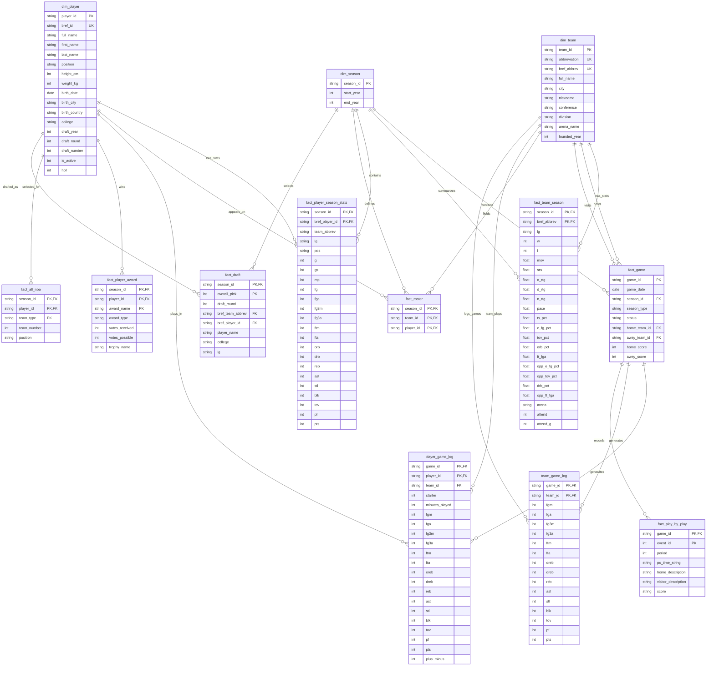
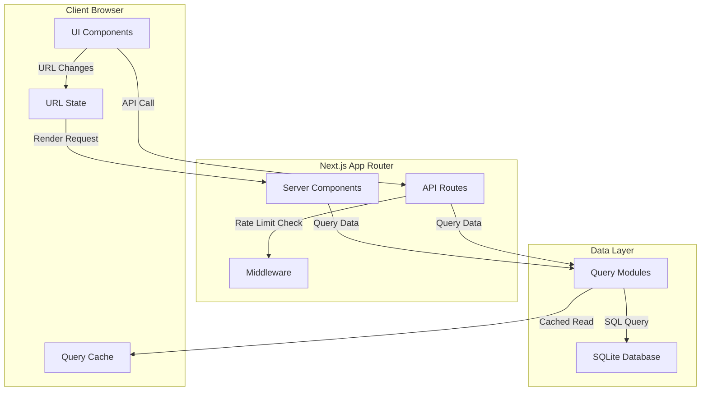

# Data Model Documentation

> Generated on: Monday Mar 16, 2026
> Project: basketball-site (NBA Reference)
> Tech Stack: Next.js 16.1.6, React 19.2.3, SQLite (better-sqlite3), TypeScript 5.x, Tailwind CSS 4.x

## Table of Contents
1. [Database Schema ERD](#1-database-schema-erd)
2. [Service Layer Models](#2-service-layer-models)
3. [UI Data Structures](#3-ui-data-structures)
4. [End-to-End Data Flow](#4-end-to-end-data-flow)
5. [Data Validation Strategy](#5-data-validation-strategy)
6. [Security Considerations](#6-security-considerations)

---

## 1. Database Schema ERD

### Overview

The basketball-site uses a **read-only SQLite database** with a star schema design optimized for analytical queries. The database is accessed via `better-sqlite3` for synchronous, high-performance queries. All data is pre-populated (no runtime writes), making it ideal for a statistics reference site.

**Key Design Patterns:**
- **Star Schema**: Dimension tables (dim_*) surrounded by fact tables (fact_*)
- **Basketball-Reference IDs**: External reference IDs (bref_id, bref_abbrev) for entity linking
- **Read-Only Access**: Database opened in readonly mode with foreign key enforcement
- **Query Caching**: 30-second TTL cache with LRU eviction (500 entry max)

### Entity Relationship Diagram



### Table Definitions

#### dim_player
- **Purpose**: Master player dimension table containing biographical and career metadata
- **Primary Key**: `player_id` (internal UUID)
- **Unique Key**: `bref_id` (Basketball-Reference identifier, e.g., "jamesle01")
- **Columns:**
  | Column | Type | Nullable | Description |
  |--------|------|----------|-------------|
  | `player_id` | TEXT | NO | Internal UUID primary key |
  | `bref_id` | TEXT | NO | Basketball-Reference ID (indexed) |
  | `full_name` | TEXT | NO | Player's full name |
  | `first_name` | TEXT | NO | First name |
  | `last_name` | TEXT | NO | Last name |
  | `position` | TEXT | YES | Primary position (G/F/C) |
  | `height_cm` | INTEGER | YES | Height in centimeters |
  | `weight_kg` | INTEGER | YES | Weight in kilograms |
  | `birth_date` | TEXT | YES | Birth date (YYYY-MM-DD) |
  | `birth_city` | TEXT | YES | Birth city |
  | `birth_country` | TEXT | YES | Birth country |
  | `college` | TEXT | YES | College attended |
  | `draft_year` | INTEGER | YES | Year drafted |
  | `draft_round` | INTEGER | YES | Draft round |
  | `draft_number` | INTEGER | YES | Overall pick number |
  | `is_active` | INTEGER | NO | 1 if active, 0 if retired |
  | `hof` | INTEGER | NO | 1 if Hall of Fame inductee |
- **Indexes:**
  - Unique index on `bref_id`
- **Foreign Keys:** None
- **Notes:** Position may be derived from most recent season stats if NULL

#### dim_team
- **Purpose**: Master team dimension table with franchise metadata
- **Primary Key**: `team_id` (internal UUID)
- **Unique Keys**: `abbreviation`, `bref_abbrev`
- **Columns:**
  | Column | Type | Nullable | Description |
  |--------|------|----------|-------------|
  | `team_id` | TEXT | NO | Internal UUID primary key |
  | `abbreviation` | TEXT | NO | Standard abbreviation (e.g., "LAL") |
  | `bref_abbrev` | TEXT | NO | Basketball-Reference abbreviation |
  | `full_name` | TEXT | NO | Full team name (City + Nickname) |
  | `city` | TEXT | NO | Team city |
  | `nickname` | TEXT | NO | Team nickname |
  | `conference` | TEXT | YES | Conference ("East" or "West") |
  | `division` | TEXT | YES | Division name |
  | `arena_name` | TEXT | YES | Home arena name |
  | `founded_year` | INTEGER | YES | Year franchise founded |
- **Indexes:**
  - Unique index on `abbreviation`
  - Unique index on `bref_abbrev`
- **Foreign Keys:** None

#### dim_season
- **Purpose**: Season dimension table defining NBA seasons
- **Primary Key**: `season_id` (format: "YYYY-YY", e.g., "2024-25")
- **Columns:**
  | Column | Type | Nullable | Description |
  |--------|------|----------|-------------|
  | `season_id` | TEXT | NO | Season identifier (YYYY-YY format) |
  | `start_year` | INTEGER | NO | Starting year (e.g., 2024) |
  | `end_year` | INTEGER | NO | Ending year (e.g., 2025) |
- **Indexes:**
  - Index on `start_year` DESC (for chronological queries)

#### fact_game
- **Purpose**: Game fact table containing all NBA games (regular season and playoffs)
- **Primary Key**: `game_id` (NBA API format, e.g., "0022400001")
- **Columns:**
  | Column | Type | Nullable | Description |
  |--------|------|----------|-------------|
  | `game_id` | TEXT | NO | Unique game identifier |
  | `game_date` | TEXT | NO | Game date (YYYY-MM-DD) |
  | `season_id` | TEXT | NO | FK to dim_season |
  | `season_type` | TEXT | NO | "Regular Season" or "Playoffs" |
  | `status` | TEXT | NO | Game status ("Final", "Scheduled", etc.) |
  | `home_team_id` | TEXT | NO | FK to dim_team (home team) |
  | `away_team_id` | TEXT | NO | FK to dim_team (away team) |
  | `home_score` | INTEGER | YES | Final home team score |
  | `away_score` | INTEGER | YES | Final away team score |
- **Indexes:**
  - Index on `season_id` + `game_date` (for season game listings)
  - Index on `game_date` DESC (for recent games)
  - Index on `home_team_id`, `away_team_id` (for team game lookups)
- **Foreign Keys:**
  - `season_id` → `dim_season(season_id)`
  - `home_team_id` → `dim_team(team_id)`
  - `away_team_id` → `dim_team(team_id)`

#### fact_team_season
- **Purpose**: Team season statistics and advanced metrics
- **Primary Key**: Composite (`season_id`, `bref_abbrev`)
- **Columns:**
  | Column | Type | Nullable | Description |
  |--------|------|----------|-------------|
  | `season_id` | TEXT | NO | Season identifier |
  | `bref_abbrev` | TEXT | NO | Team abbreviation |
  | `lg` | TEXT | YES | League ("NBA") |
  | `w` | INTEGER | YES | Wins |
  | `l` | INTEGER | YES | Losses |
  | `mov` | REAL | YES | Margin of Victory |
  | `srs` | REAL | YES | Simple Rating System |
  | `o_rtg` | REAL | YES | Offensive Rating |
  | `d_rtg` | REAL | YES | Defensive Rating |
  | `n_rtg` | REAL | YES | Net Rating |
  | `pace` | REAL | YES | Possessions per 48 min |
  | `ts_pct` | REAL | YES | True Shooting % |
  | `e_fg_pct` | REAL | YES | Effective FG % |
  | `tov_pct` | REAL | YES | Turnover % |
  | `orb_pct` | REAL | YES | Offensive Rebound % |
  | `ft_fga` | REAL | YES | FT per FGA |
  | `opp_e_fg_pct` | REAL | YES | Opponent eFG% |
  | `opp_tov_pct` | REAL | YES | Opponent TOV% |
  | `drb_pct` | REAL | YES | Defensive Rebound % |
  | `opp_ft_fga` | REAL | YES | Opponent FT/FGA |
  | `arena` | TEXT | YES | Arena name |
  | `attend` | INTEGER | YES | Total attendance |
  | `attend_g` | INTEGER | YES | Attendance per game |
- **Foreign Keys:**
  - `season_id` → `dim_season(season_id)`
  - `bref_abbrev` → `dim_team(bref_abbrev)`

#### fact_player_season_stats
- **Purpose**: Player season statistics (per-game totals)
- **Primary Key**: Composite (`season_id`, `bref_player_id`)
- **Columns:**
  | Column | Type | Nullable | Description |
  |--------|------|----------|-------------|
  | `season_id` | TEXT | NO | Season identifier |
  | `bref_player_id` | TEXT | NO | Player BRef ID |
  | `team_abbrev` | TEXT | YES | Team abbreviation |
  | `lg` | TEXT | YES | League |
  | `pos` | TEXT | YES | Position played |
  | `g` | INTEGER | YES | Games played |
  | `gs` | INTEGER | YES | Games started |
  | `mp` | INTEGER | YES | Minutes played |
  | `fg` | INTEGER | YES | Field goals made |
  | `fga` | INTEGER | YES | Field goals attempted |
  | `fg3m` | INTEGER | YES | 3-pointers made |
  | `fg3a` | INTEGER | YES | 3-pointers attempted |
  | `ftm` | INTEGER | YES | Free throws made |
  | `fta` | INTEGER | YES | Free throws attempted |
  | `orb` | INTEGER | YES | Offensive rebounds |
  | `drb` | INTEGER | YES | Defensive rebounds |
  | `reb` | INTEGER | YES | Total rebounds |
  | `ast` | INTEGER | YES | Assists |
  | `stl` | INTEGER | YES | Steals |
  | `blk` | INTEGER | YES | Blocks |
  | `tov` | INTEGER | YES | Turnovers |
  | `pf` | INTEGER | YES | Personal fouls |
  | `pts` | INTEGER | YES | Points |
- **Foreign Keys:**
  - `season_id` → `dim_season(season_id)`
  - `bref_player_id` → `dim_player(bref_id)`

#### player_game_log
- **Purpose**: Player game-by-game statistics (box scores)
- **Primary Key**: Composite (`game_id`, `player_id`)
- **Columns:**
  | Column | Type | Nullable | Description |
  |--------|------|----------|-------------|
  | `game_id` | TEXT | NO | Game identifier |
  | `player_id` | TEXT | NO | Player internal ID |
  | `team_id` | TEXT | NO | Team internal ID |
  | `starter` | INTEGER | YES | 1 if started game |
  | `minutes_played` | INTEGER | YES | Minutes played |
  | `fgm` | INTEGER | YES | Field goals made |
  | `fga` | INTEGER | YES | Field goals attempted |
  | `fg3m` | INTEGER | YES | 3-pointers made |
  | `fg3a` | INTEGER | YES | 3-pointers attempted |
  | `ftm` | INTEGER | YES | Free throws made |
  | `fta` | INTEGER | YES | Free throws attempted |
  | `oreb` | INTEGER | YES | Offensive rebounds |
  | `dreb` | INTEGER | YES | Defensive rebounds |
  | `reb` | INTEGER | YES | Total rebounds |
  | `ast` | INTEGER | YES | Assists |
  | `stl` | INTEGER | YES | Steals |
  | `blk` | INTEGER | YES | Blocks |
  | `tov` | INTEGER | YES | Turnovers |
  | `pf` | INTEGER | YES | Personal fouls |
  | `pts` | INTEGER | YES | Points scored |
  | `plus_minus` | INTEGER | YES | Plus/minus rating |
- **Foreign Keys:**
  - `game_id` → `fact_game(game_id)`
  - `player_id` → `dim_player(player_id)`
  - `team_id` → `dim_team(team_id)`

#### team_game_log
- **Purpose**: Team game-by-game statistics
- **Primary Key**: Composite (`game_id`, `team_id`)
- **Columns:** Similar structure to player_game_log at team level
- **Foreign Keys:**
  - `game_id` → `fact_game(game_id)`
  - `team_id` → `dim_team(team_id)`

#### fact_play_by_play
- **Purpose**: Play-by-play event stream for games
- **Primary Key**: Composite (`game_id`, `event_id`)
- **Columns:**
  | Column | Type | Nullable | Description |
  |--------|------|----------|-------------|
  | `game_id` | TEXT | NO | Game identifier |
  | `event_id` | INTEGER | NO | Sequential event number |
  | `period` | INTEGER | YES | Quarter/OT period |
  | `pc_time_string` | TEXT | YES | Clock time (MM:SS) |
  | `home_description` | TEXT | YES | Description of home team action |
  | `visitor_description` | TEXT | YES | Description of away team action |
  | `score` | TEXT | YES | Running score (e.g., "45-52") |
- **Foreign Keys:**
  - `game_id` → `fact_game(game_id)`

#### fact_roster
- **Purpose**: Team rosters by season (player-team associations)
- **Primary Key**: Composite (`season_id`, `team_id`, `player_id`)
- **Columns:**
  | Column | Type | Nullable | Description |
  |--------|------|----------|-------------|
  | `season_id` | TEXT | NO | Season identifier |
  | `team_id` | TEXT | NO | Team internal ID |
  | `player_id` | TEXT | NO | Player internal ID |
- **Foreign Keys:**
  - `season_id` → `dim_season(season_id)`
  - `team_id` → `dim_team(team_id)`
  - `player_id` → `dim_player(player_id)`

#### fact_player_award
- **Purpose**: Player awards (MVP, DPOY, ROY, etc.)
- **Primary Key**: Composite (`season_id`, `player_id`, `award_name`)
- **Columns:**
  | Column | Type | Nullable | Description |
  |--------|------|----------|-------------|
  | `season_id` | TEXT | NO | Season identifier |
  | `player_id` | TEXT | NO | Player BRef ID |
  | `award_name` | TEXT | NO | Award name ("MVP", "DPOY", "ROY") |
  | `award_type` | TEXT | YES | Award category |
  | `votes_received` | INTEGER | YES | Votes received |
  | `votes_possible` | INTEGER | YES | Total possible votes |
  | `trophy_name` | TEXT | YES | Named trophy (e.g., "Michael Jordan Trophy") |
- **Foreign Keys:**
  - `season_id` → `dim_season(season_id)`
  - `player_id` → `dim_player(bref_id)`

#### fact_all_nba
- **Purpose**: All-NBA and All-Defensive team selections
- **Primary Key**: Composite (`season_id`, `player_id`, `team_type`)
- **Columns:**
  | Column | Type | Nullable | Description |
  |--------|------|----------|-------------|
  | `season_id` | TEXT | NO | Season identifier |
  | `player_id` | TEXT | NO | Player BRef ID |
  | `team_type` | TEXT | NO | "All-NBA" or "All-Defense" |
  | `team_number` | INTEGER | YES | 1 (First), 2 (Second), 3 (Third) |
  | `position` | TEXT | YES | Position on team (F, C, G) |
- **Foreign Keys:**
  - `season_id` → `dim_season(season_id)`
  - `player_id` → `dim_player(bref_id)`

#### fact_draft
- **Purpose**: NBA draft history
- **Primary Key**: Composite (`season_id`, `overall_pick`)
- **Columns:**
  | Column | Type | Nullable | Description |
  |--------|------|----------|-------------|
  | `season_id` | TEXT | NO | Draft season |
  | `overall_pick` | INTEGER | NO | Overall pick number |
  | `draft_round` | INTEGER | YES | Round number |
  | `bref_team_abbrev` | TEXT | YES | Drafting team |
  | `bref_player_id` | TEXT | YES | Player drafted |
  | `player_name` | TEXT | YES | Player name at draft |
  | `college` | TEXT | YES | College at draft |
  | `lg` | TEXT | YES | League |
- **Foreign Keys:**
  - `season_id` → `dim_season(season_id)`
  - `bref_team_abbrev` → `dim_team(bref_abbrev)`
  - `bref_player_id` → `dim_player(bref_id)`

---

## 2. Service Layer Models

### Overview

The service layer uses a **functional query pattern** rather than traditional OOP services. Data access is organized into domain-specific query modules that provide typed database access with built-in caching.

**Key Patterns:**
- **Query Modules**: Domain-organized functions (`queries/players`, `queries/teams`, etc.)
- **Cached Queries**: All queries use `getCachedQueryOne<T>` or `getCachedQueryMany<T>` with TTL
- **Row Types**: Explicit TypeScript interfaces for database row shapes
- **DTO Pattern**: Request/response types for API boundaries

### Data Transfer Objects (DTOs)

#### API Request/Response Types

**Search API Request**
```typescript
interface SearchRequest {
  q: string;           // Search query (min 2 characters)
  type?: string;       // Optional filter: 'player' | 'team' | 'season' | 'game' | 'award' | 'page'
}
```

**Search API Response**
```typescript
interface SearchApiResponse {
  meta: {
    limit: number;      // Max results returned
    query: string;      // Normalized query
    type: string | null; // Applied type filter
  };
  results: SearchEntityResult[];
}
```

**Search Entity Result (Cross-entity search result)**
```typescript
type SearchResultType = 'player' | 'team' | 'season' | 'game' | 'award' | 'page';

interface SearchEntityResult {
  id: string;                    // Entity identifier
  label: string;                 // Display name
  description: string | null;    // Secondary info (position, team, etc.)
  href: Route;                   // Next.js typed route
  type: SearchResultType;        // Entity category
}
```

**Pagination State**
```typescript
interface PaginationState<T> {
  currentPage: number;   // 1-indexed current page
  endItem: number;       // Last item number on this page
  items: T[];            // Paginated items
  pageSize: number;      // Items per page
  startItem: number;     // First item number on this page
  totalItems: number;    // Total items across all pages
  totalPages: number;    // Total number of pages
}

type PaginationToken = number | 'ellipsis';
```

**API Error Response**
```typescript
interface ApiErrorResponse {
  error: {
    code: string;       // Error code (snake_case)
    message: string;      // Human-readable error message
  };
}
```

#### Domain Query Types

**Player Profile**
```typescript
interface PlayerProfile {
  player_id: string;           // Internal UUID
  bref_id: string;             // Basketball-Reference ID
  full_name: string;           // Display name
  first_name: string;
  last_name: string;
  position: string | null;     // Primary position
  height_cm: number | null;    // Metric height
  weight_kg: number | null;    // Metric weight
  birth_date: string | null;   // YYYY-MM-DD
  birth_city: string | null;
  birth_country: string | null;
  college: string | null;
  draft_year: number | null;
  draft_round: number | null;
  draft_number: number | null;
  is_active: number;           // 1 = active, 0 = retired
  hof: number;                 // 1 = Hall of Famer
}
```

**Team Information**
```typescript
interface TeamInfo {
  team_id: string;
  abbreviation: string;
  full_name: string;
  city: string;
  nickname: string;
  conference: string | null;   // "East" | "West"
  division: string | null;
  arena_name: string | null;
  founded_year: number | null;
}
```

**Team Standing Row**
```typescript
interface TeamStandingRow {
  team_abbrev: string;         // Team abbreviation
  team_name: string;           // Full team name
  conference: string | null; // East/West
  w: number;                   // Wins
  l: number;                   // Losses
  win_pct: number;             // Win percentage (0-1)
  gb: number | null;           // Games behind leader
  ps_g: number | null;         // Points scored per game
  pa_g: number | null;         // Points allowed per game
}
```

**Recent Game Row**
```typescript
interface RecentGameRow {
  game_id: string;
  game_date: string;           // YYYY-MM-DD
  home_abbrev: string;
  away_abbrev: string;
  home_score: number | null;
  away_score: number | null;
}
```

**Award Winner Row**
```typescript
interface AwardWinnerRow {
  bref_id: string;
  full_name: string;
  team_abbrev: string | null;
  team_name: string | null;
  votes_received: number | null;
  votes_possible: number | null;
  vote_percentage: number | null;  // Computed percentage
}

interface AwardHistoryRow extends AwardWinnerRow {
  season_id: string;
  start_year: number;
  end_year: number;
}
```

**All-NBA Selection Row**
```typescript
interface AllTeamSelectionRow {
  team_number: number;         // 1=First, 2=Second, 3=Third
  position: string;            // F, C, G
  bref_id: string;
  full_name: string;
  team_abbrev: string | null;
  team_name: string | null;
}

interface AllTeamHistoryRow extends AllTeamSelectionRow {
  season_id: string;
  start_year: number;
  end_year: number;
  team_name: string;           // "First Team", "Second Team", etc.
}
```

**Playoff Series Row**
```typescript
interface PlayoffSeriesRow {
  home_abbrev: string;
  away_abbrev: string;
  home_name: string;
  away_name: string;
  total_games: number;         // Games played in series
  home_wins: number;
  away_wins: number;
  winner_abbrev: string;       // Series winner
  series_id: string;           // Game ID of first game
}

interface PlayoffSeriesGameRow {
  game_id: string;
  game_date: string;
  home_score: number;
  away_score: number;
  home_abbrev: string;
  away_abbrev: string;
  home_name: string;
  away_name: string;
  winner_abbrev: string;
}
```

**Player Split Row**
```typescript
interface PlayerSplitRow {
  split_value: string;         // Category value (e.g., "Home", "January")
  g: number;                   // Games
  mp: number;                  // Minutes played
  pts: number;                 // Points
  reb: number;                 // Rebounds
  ast: number;                 // Assists
  fg: number;                  // Field goals made
  fga: number;                 // Field goals attempted
  x3p: number;                 // 3-pointers made
  x3pa: number;                // 3-pointers attempted
  ft: number;                  // Free throws made
  fta: number;                 // Free throws attempted
}
```

**Player Directory Row**
```typescript
interface PlayerDirectoryRow {
  bref_id: string;
  full_name: string;
  position: string | null;
  is_active: number;           // 1 = active, 0 = retired
}
```

**Team Directory Row**
```typescript
interface TeamDirectoryRow {
  abbreviation: string;
  full_name: string;
  conference: string | null;
  division: string | null;
}
```

**Playoff Leader Row**
```typescript
interface PlayoffLeaderRow {
  bref_id: string;
  full_name: string;
  team_abbrev: string;
  games: number;
  total_pts?: number | null;
  total_reb?: number | null;
  total_ast?: number | null;
  total_ws?: number | null;
  pts_pg?: number | null;
  reb_pg?: number | null;
  ast_pg?: number | null;
  ws_pg?: number | null;
}
```

### Page Data Aggregates

**Player Page Data (Composite)**
```typescript
interface PlayerPageData {
  player: PlayerProfile | undefined;
  summary: ReturnType<typeof getPlayerCareerSummary>;  // Career totals
  perGameStats: DbRecord[];      // Last N seasons, per-game averages
  per36Stats: DbRecord[];         // Per-36-minute stats
  per100Stats: DbRecord[];        // Per-100-possession stats
  seasonStats: DbRecord[];         // Raw season totals
  advancedStats: DbRecord[];     // Advanced metrics
  shootingStats: DbRecord[];      // Shooting breakdowns
  adjustedShootingStats: DbRecord[];  // Era-adjusted shooting
  pbpStats: DbRecord[];           // Play-by-play derived stats
  fullGameLog: DbRecord[];        // Recent games
  awards: Array<{ award_name: string; [key: string]: string | number | null }>;
  awardCounts: Array<[string, number]>;  // Aggregated award totals
  salaries: DbRecord[];           // Salary history
  highs: Record<string, number | null>;  // Career highs
}

type DbRecord = Record<string, string | number | null>;
```

**Season Awards Data**
```typescript
interface SeasonAwardsData {
  mvp: AwardWinnerRow | undefined;
  dpoy: AwardWinnerRow | undefined;
  roy: AwardWinnerRow | undefined;
  allNBA: {
    first: AllTeamSelectionRow[];
    second: AllTeamSelectionRow[];
    third: AllTeamSelectionRow[];
  };
  allDefense: {
    first: AllTeamSelectionRow[];
    second: AllTeamSelectionRow[];
  };
}
```

**Playoff Bracket Data**
```typescript
interface PlayoffBracketData {
  east: Record<string, PlayoffSeriesRow[]>;  // By round
  west: Record<string, PlayoffSeriesRow[]>; // By round
  finals: NbaFinalsRow | undefined;
}

interface NbaFinalsRow {
  home_abbrev: string;
  away_abbrev: string;
  home_name: string;
  away_name: string;
  total_games: number;
  home_wins: number;
  away_wins: number;
  winner_abbrev: string;
  series_id: string;
}
```

### Domain Query Modules

| Module | Path | Purpose |
|--------|------|---------|
| Player Queries | `queries/players/` | Profile, stats, game logs, salaries |
| Team Queries | `queries/teams.ts` | Team info, rosters, season stats |
| Game Queries | `queries/games.ts` | Box scores, play-by-play, line scores |
| Season Queries | `queries/seasons.ts` | Season lists, leaders, summaries |
| Awards Queries | `queries/awards.ts` | MVP, DPOY, ROY, All-NBA |
| Playoff Queries | `queries/playoffs.ts` | Brackets, series, playoff leaders |
| Draft Queries | `queries/draft.ts` | Draft history by season |
| Standings Queries | `queries/standings.ts` | Computed standings as of date |
| Leaders Queries | `queries/leaders.ts` | League leaderboards |
| All-Star Queries | `queries/allstar.ts` | All-Star game rosters |
| Splits Queries | `queries/player-splits.ts` | Player splits by category |
| Franchise Queries | `queries/franchise.ts` | Franchise history |
| Frivolities Queries | `queries/frivolities.ts` | Birthdays, colleges |
| Schedule Queries | `queries/team-schedule.ts` | Team schedules |

---

## 3. UI Data Structures

### Overview

The UI uses **Server Components by default** with selective Client Components for interactivity. No global state management library is used - state is managed via:
- URL query parameters (pagination, sorting, filtering)
- React useState for local UI state
- Server-side data fetching with caching

### Component Props

**StatsTable Component**
```typescript
interface StatsTableColumnLink {
  type: 'player' | 'team' | 'league' | 'boxscore' | 'game';
  valueKey?: string;    // Optional override for link value
}

interface StatsTableProps {
  columns: Array<{
    key: string;          // Column identifier (matches row key)
    label: string;        // Header display text
    align?: 'left' | 'right';  // Text alignment
    link?: StatsTableColumnLink; // Optional drill-down link
  }>;
  rows: DbRows;          // Data rows (array of Record<string, RowValue>)
  initialSort?: string;  // Default sort column
  tableId?: string;      // For URL-persisted sort state
}

type RowValue = string | number | null;
type DbRow = Record<string, RowValue>;
type DbRows = DbRow[];
```

**SearchBox Component**
```typescript
interface SearchBoxProps {
  initialQuery?: string;  // Pre-populated search text
}

// Internal state
type SearchState = {
  query: string;
  results: SearchEntityResult[];
  activeIndex: number;    // Keyboard navigation
  hasSearched: boolean;
  isLoading: boolean;
};
```

**PaginationNav Component**
```typescript
interface PaginationNavProps {
  currentPage: number;
  totalPages: number;
  basePath: string;       // Route path without page param
  surroundingCount?: number; // Number of page buttons to show
}
```

**SeasonStandingsSection Component**
```typescript
interface SeasonStandingsSectionProps {
  seasonId: string;
  standings: TeamStandingRow[];  // Conference-organized standings
}
```

**SeasonAwardsSummary Component**
```typescript
interface SeasonAwardsSummaryProps {
  seasonId: string;
  awards: SeasonAwardsData;
}
```

**AllDefenseSelectionsTable Component**
```typescript
interface AllDefenseSelectionsTableProps {
  selections: {
    first: AllTeamSelectionRow[];
    second: AllTeamSelectionRow[];
  };
}
```

**RelatedLinksPanel Component**
```typescript
interface RelatedLink {
  href: Route;
  label: string;
  description?: string;
}

interface RelatedLinksPanelProps {
  links: RelatedLink[];
  title?: string;
}
```

### State Management

**No Global State Library** - The application follows Next.js App Router patterns:

1. **Server State**: Data fetched via cached database queries in Server Components
2. **URL State**: Pagination, sorting, and filtering stored in URL search params
3. **Local State**: React useState for ephemeral UI state (dropdowns, hover, etc.)

**Example URL State Pattern (StatsTable Sorting)**
```typescript
// URL: /players/j/jamesle01?stats-sort=pts&stats-dir=desc
const searchParams = useSearchParams();
const sortKey = searchParams.get('stats-sort') ?? 'pts';
const direction = searchParams.get('stats-dir') ?? 'desc';

// Update via client-side navigation
window.history.replaceState(null, '', `${pathname}?${params.toString()}`);
```

**Rate Limiting State (Middleware)**
```typescript
interface RateLimitEntry {
  timestamps: number[];   // Request timestamps in window
}

// In-memory Map (per-IP tracking)
const rateLimitStore = new Map<string, RateLimitEntry>();

interface RateLimitStatus {
  remaining: number;    // Requests left in window
  reset: number;         // Epoch ms when window resets
}
```

### Query Cache State

```typescript
interface CacheEntry {
  expiresAt: number;     // Unix timestamp (ms)
  value: unknown;        // Cached query result
}

// LRU cache with 500 entry max
const queryResultCache = new Map<string, CacheEntry>();

interface QueryCacheStats {
  entries: number;       // Current cached entries
  maxEntries: number;    // Maximum (500)
}
```

### Route Parameters

**Dynamic Route Types**
```typescript
// /players/[letter]/[id]/page.tsx
interface PlayerPageParams {
  letter: string;        // First letter of bref_id
  id: string;            // Full bref_id
}

// /teams/[abbrev]/[season]/page.tsx
interface TeamSeasonPageParams {
  abbrev: string;        // Team abbreviation
  season?: string;       // Optional season ID
}

// /games/[id]/page.tsx
interface GamePageParams {
  id: string;            // Game ID
}

// /seasons/[year]/page.tsx
interface SeasonPageParams {
  year: string;          // Season ID (e.g., "2024-25")
}

// /boxscores/[id]/page.tsx
interface BoxscorePageParams {
  id: string;            // Game ID
}
```

---

## 4. End-to-End Data Flow

### Overview

The application follows a **Server-First Architecture** where data fetching occurs primarily in Server Components, minimizing client-side JavaScript.



### Example Flow: Player Page Load

**1. Browser Request**
```
GET /players/j/jamesle01
```

**2. Server Component Data Fetching**
```typescript
// app/players/[letter]/[id]/page.tsx
export default function PlayerPage({ params }: { params: Promise<{ letter: string; id: string }> }) {
  const { id } = await params;
  const data = getPlayerPageData(id);  // Server-side data fetch
  
  if (!data?.player) {
    notFound();
  }
  
  return <PlayerPageClient data={data} />;
}
```

**3. Query Module Execution**
```typescript
// lib/query/player-page.ts
export function getPlayerPageData(brefId: string): PlayerPageData | undefined {
  const player = getPlayerByBrefId(brefId);  // queries/players/profile.ts
  if (!player) return undefined;
  
  // Parallel data fetching
  const perGameStats = getPlayerPerGameStats(brefId, 25);
  const advancedStats = getPlayerAdvancedSeasonStats(brefId, 25);
  const awards = getPlayerAwards(player.player_id, 100);
  // ... more queries
  
  return { player, perGameStats, advancedStats, awards, ... };
}
```

**4. Database Query (with Caching)**
```typescript
// lib/db.ts - Cached Query Pattern
export function getCachedQueryMany<T>(sql: string, params: unknown[], ttlMs = 30_000): T {
  const key = `many:${sql}::${JSON.stringify(params)}`;
  
  // Check cache
  const cached = readCachedResult<T>(key);
  if (cached !== undefined) return cached;
  
  // Execute query
  const result = getDb().prepare(sql).all(...params) as T;
  
  // Store in cache
  return writeCachedResult(key, result, ttlMs);
}
```

**5. Render to HTML (Server)**
- Server Component renders complete HTML with data
- Client receives static HTML + minimal JS for interactivity
- StatsTable sort state persisted in URL

**6. User Interaction: Sort StatsTable**
```typescript
// Client-side (StatsTable.tsx)
const handleSort = (columnKey: string) => {
  const params = new URLSearchParams(searchParams.toString());
  params.set('stats-sort', columnKey);
  params.set('stats-dir', direction === 'asc' ? 'desc' : 'asc');
  
  // Update URL (triggers re-render with new sort)
  window.history.replaceState(null, '', `${pathname}?${params.toString()}`);
};
```

### Example Flow: Search API

**1. User Types in SearchBox**
```typescript
// components/search-box.tsx
useEffect(() => {
  const controller = new AbortController();
  const timer = setTimeout(() => {
    void debouncedSearch(trimmedQuery, controller.signal);
  }, 200);  // 200ms debounce
  
  return () => {
    clearTimeout(timer);
    controller.abort();  // Cancel in-flight requests
  };
}, [trimmedQuery]);
```

**2. API Request**
```
GET /api/search?q=james&type=player
```

**3. Rate Limit Check (Middleware)**
```typescript
// middleware/rate-limit.ts
export function checkRateLimit(req: NextRequest): NextResponse | null {
  const ip = extractClientIp(req);
  const entry = rateLimitStore.get(ip) ?? { timestamps: [] };
  
  // 100 requests per minute per IP
  if (entry.timestamps.length >= RATE_LIMIT) {
    return NextResponse.json(
      { error: { code: 'rate_limited', message: 'Too many requests' } },
      { status: 429 }
    );
  }
  
  entry.timestamps.push(Date.now());
  rateLimitStore.set(ip, entry);
  return null;  // Allow request
}
```

**4. API Handler**
```typescript
// app/api/search/route.ts
export function GET(req: NextRequest): Response {
  const rateLimitResponse = checkRateLimit(req);
  if (rateLimitResponse) return rateLimitResponse;
  
  const query = req.nextUrl.searchParams.get('q')?.trim() ?? '';
  const type = req.nextUrl.searchParams.get('type')?.trim();
  
  const results = searchEntities(query, 
    type ? { limit: 8, types: [type] } : { limit: 8 }
  );
  
  return createApiJsonResponse(req, { meta: { query, type, limit: 8 }, results });
}
```

**5. Search Query Execution**
```typescript
// lib/query/search.ts
export function searchEntities(query: string, options: SearchEntitiesOptions = {}): SearchEntityResult[] {
  const normalizedQuery = normalizeQuery(query);
  if (normalizedQuery.length < 2) return [];
  
  const types = filterTypes(options.types);
  const results: SearchEntityResult[] = [];
  
  for (const type of types) {
    switch (type) {
      case 'player':
        results.push(...buildPlayerResults(normalizedQuery, perTypeLimit));
        break;
      case 'team':
        results.push(...buildTeamResults(normalizedQuery, perTypeLimit));
        break;
      // ... other types
    }
  }
  
  return results.slice(0, options.limit ?? 24);
}
```

**6. Response to Client**
```json
{
  "meta": { "query": "james", "type": "player", "limit": 8 },
  "results": [
    {
      "id": "jamesle01",
      "label": "LeBron James",
      "description": "SF · Active",
      "href": "/players/j/jamesle01",
      "type": "player"
    }
  ]
}
```

**Data Transformations:**
| Stage | Data Format | Transformation |
|-------|-------------|----------------|
| Database | Raw SQL rows | SQLite query results |
| Query Module | Typed interfaces | Cast to TypeScript interfaces |
| Search Function | SearchEntityResult[] | Map to unified result type |
| API Response | JSON | Serialize with NextResponse.json() |
| Client Component | SearchEntityResult[] | Parse JSON, render UI |

---

## 5. Data Validation Strategy

### Route Parameter Validation

```typescript
// lib/validation.ts
export function validatePlayerId(id: string): string {
  if (!id || !/^[a-z]{2,}\d{2}$/.test(id)) {
    notFound();
  }
  return id;
}

export function validateSeasonId(seasonId: string): string {
  if (!seasonId || !/^\d{4}-\d{2}$/.test(seasonId)) {
    notFound();
  }
  return seasonId;
}

export function validateTeamAbbrev(abbrev: string): string {
  const normalized = abbrev?.toUpperCase();
  if (!normalized || !/^[A-Z]{2,4}$/.test(normalized)) {
    notFound();
  }
  return normalized;
}
```

### Search Query Validation

```typescript
// lib/query/search.ts
function normalizeQuery(query: string): string {
  return query.trim().toLowerCase();
}

function clampLimit(limit: number | undefined): number {
  if (limit == null || !Number.isFinite(limit)) {
    return DEFAULT_RESULTS_LIMIT;  // 24
  }
  return Math.max(1, Math.min(Math.floor(limit), 240));  // Max 240 results
}

// Minimum query length: 2 characters
if (normalizedQuery.length < 2) {
  return [];
}
```

### Pagination Validation

```typescript
// lib/pagination.ts
export function coercePageNumber(value: string | number | undefined): number {
  if (typeof value === 'number' && Number.isInteger(value) && value > 0) {
    return value;
  }
  
  if (typeof value !== 'string') {
    return 1;
  }
  
  const parsed = Number.parseInt(value, 10);
  return Number.isInteger(parsed) && parsed > 0 ? parsed : 1;
}

export function paginateItems<T>(items: T[], currentPage: number, pageSize: number): PaginationState<T> {
  const safePageSize = Math.max(1, Math.floor(pageSize));
  const totalPages = Math.max(1, Math.ceil(items.length / safePageSize));
  const safeCurrentPage = Math.min(Math.max(1, Math.floor(currentPage)), totalPages);
  
  // ... paginate with validated values
}
```

### Database Constraints

All database validation is handled via SQLite constraints:
- **Primary Keys**: Unique entity identifiers
- **Foreign Keys**: Referential integrity (enforced via `PRAGMA foreign_keys = ON`)
- **Check Constraints**: Domain validation (defined in schema)
- **NOT NULL**: Required fields

---

## 6. Security Considerations

### Read-Only Database
- Database opened with `readonly: true` flag
- No runtime mutations possible
- All data pre-populated via ETL pipelines

### SQL Injection Prevention
- All queries use parameterized statements
- No string concatenation of user input into SQL
- Example: `.prepare("SELECT * FROM players WHERE id = ?").get(userId)`

### Rate Limiting
- 100 requests per minute per IP
- In-memory store with LRU cleanup
- Headers expose rate limit status to clients

### Security Headers (via next.config.ts)
- Content Security Policy (CSP)
- Strict-Transport-Security (HSTS)
- X-Frame-Options: DENY
- X-Content-Type-Options: nosniff
- Referrer-Policy

### Input Sanitization
- All route parameters validated before use
- Search queries normalized and length-limited
- Type coercion with fallback to safe defaults

---

## Appendix: Type Definitions Reference

### Core Type Aliases
```typescript
// lib/types.ts
export type RowValue = string | number | null;
export type DbRow = Record<string, RowValue>;
export type DbRows = DbRow[];
```

### Route Type Safety
```typescript
// lib/routes.ts
import type { Route } from 'next';

export const routes = {
  player: (letter: string, id: string): Route => `/players/${letter}/${id}`,
  team: (abbrev: string): Route => `/teams/${abbrev.toUpperCase()}`,
  teamSeason: (abbrev: string, season: string): Route => 
    `/teams/${abbrev.toUpperCase()}/${season}`,
  game: (gameId: string): Route => `/games/${gameId}`,
  boxscore: (gameId: string): Route => `/boxscores/${gameId}`,
  league: (slug: string): Route => `/leagues/${slug}`,
  draft: (year: string | number): Route => `/draft/${year}`,
  search: (query?: string, type?: string, page?: number): Route => {
    // Query param construction
  },
};
```

### Cache Configuration
```typescript
// Default TTL values (milliseconds)
const CACHE_TTL = {
  DEFAULT: 30_000,      // 30 seconds
  HOME: 20_000,         // 20 seconds (homepage)
  SEARCH: 5_000,        // 5 seconds (search results)
  SEASON: 30_000,       // 30 seconds (season data)
  AWARDS: 60_000,       // 60 seconds (awards - rarely change)
  DIRECTORY: 60_000,    // 60 seconds (player/team lists)
  STANDINGS: 60_000,    // 60 seconds (computed standings)
} as const;

const MAX_QUERY_CACHE_SIZE = 500;  // LRU eviction threshold
```

---

*Documentation generated automatically from source code analysis.*
*Last updated: Monday Mar 16, 2026*
