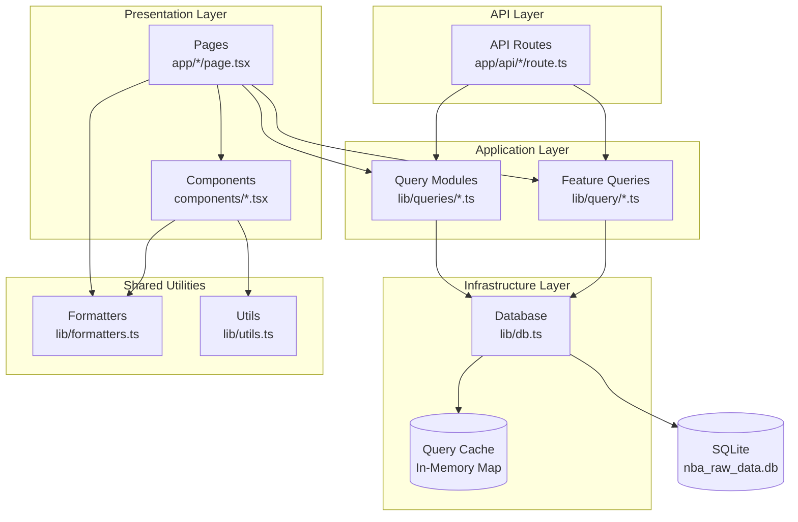
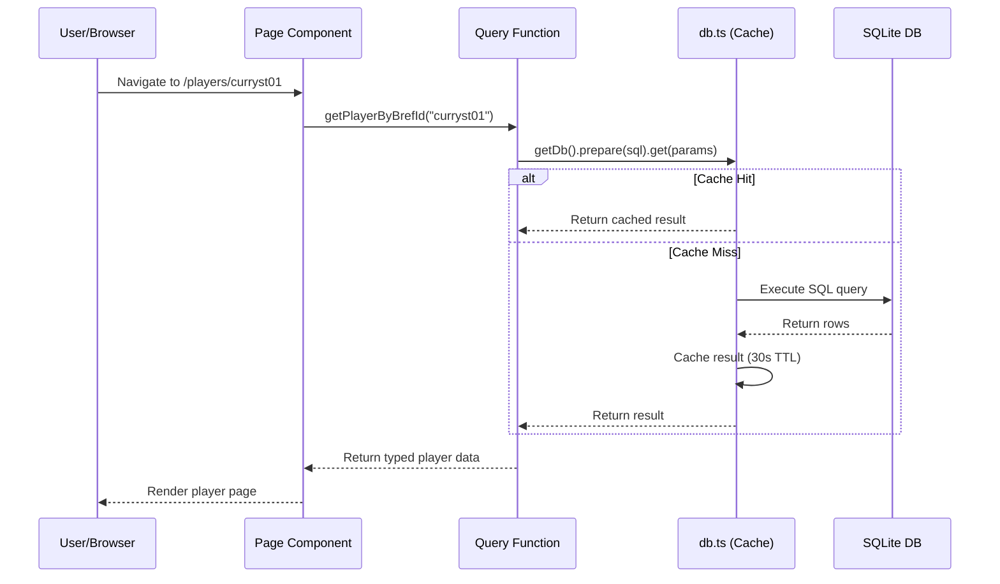
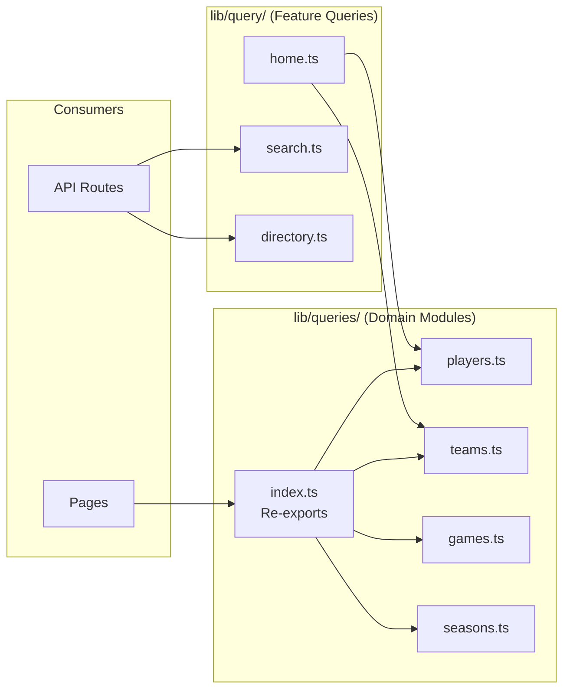

# NBA Reference Architecture Documentation

> **Last Updated:** March 2026  
> **Version:** 1.0  
> **Status:** Post-Reorganization

---

## Table of Contents

1. [Overview](#1-overview)
2. [Architecture Pattern](#2-architecture-pattern)
3. [Directory Structure](#3-directory-structure)
4. [Layer Responsibilities](#4-layer-responsibilities)
5. [Dependency Rules](#5-dependency-rules)
6. [Data Flow](#6-data-flow)
7. [Architecture Diagrams](#7-architecture-diagrams)
8. [Naming Conventions](#8-naming-conventions)
9. [Testing Strategy](#9-testing-strategy)
10. [Migration Notes](#10-migration-notes)

---

## 1. Overview

### Project Description

NBA Reference is a Basketball-Reference clone built as a modern web application
providing comprehensive basketball statistics, historical team records, and
player attributes. The application serves as a read-only interface to a
pre-populated SQLite database containing NBA data.

### Tech Stack

| Category            | Technology           | Version |
| ------------------- | -------------------- | ------- |
| **Framework**       | Next.js (App Router) | 16.x    |
| **Language**        | TypeScript           | 5.x     |
| **Styling**         | Tailwind CSS         | 4.x     |
| **Database**        | SQLite               | 3.x     |
| **Database Driver** | better-sqlite3       | 12.x    |
| **Testing**         | Vitest               | 3.x     |
| **React**           | React                | 19.x    |

### Key Characteristics

- **Server-First:** Heavy use of Next.js Server Components for data fetching
- **Read-Optimized:** All database operations are read-only; no mutations
- **Cached Queries:** Built-in query result caching with TTL support
- **Type-Safe:** Full TypeScript coverage with strict mode enabled

---

## 2. Architecture Pattern

### Layered Architecture with Clean Architecture Elements

The application follows a **Layered Architecture** pattern with influences from
**Clean Architecture** principles. This ensures:

- **Separation of Concerns:** Each layer has a distinct responsibility
- **Dependency Inversion:** Inner layers don't depend on outer layers
- **Testability:** Business logic can be tested independently of infrastructure

### Layer Hierarchy

```
┌─────────────────────────────────────────────────────┐
│                 PRESENTATION LAYER                   │
│     (Pages, Components, UI Elements)                │
├─────────────────────────────────────────────────────┤
│                    API LAYER                         │
│     (REST Endpoints, Route Handlers)                │
├─────────────────────────────────────────────────────┤
│                 APPLICATION LAYER                    │
│     (Query Functions, Business Logic)               │
├─────────────────────────────────────────────────────┤
│                INFRASTRUCTURE LAYER                  │
│     (Database Connection, Caching)                  │
└─────────────────────────────────────────────────────┘
```

---

## 3. Directory Structure

### Complete Annotated File Tree

```
nba-reference/
├── src/
│   ├── app/                          # Next.js App Router (Presentation + API)
│   │   ├── layout.tsx                # Root layout with header/footer
│   │   ├── page.tsx                  # Homepage
│   │   ├── globals.css               # Global styles (Tailwind)
│   │   │
│   │   ├── api/                      # API Layer - REST Endpoints
│   │   │   ├── search/
│   │   │   │   └── route.ts          # GET /api/search?q=...
│   │   │   └── export/
│   │   │       └── [type]/
│   │   │           └── route.ts      # GET /api/export/players|teams|games
│   │   │
│   │   ├── players/                  # Player Pages
│   │   │   ├── page.tsx              # /players - Player directory
│   │   │   └── [id]/
│   │   │       └── page.tsx          # /players/[id] - Player detail
│   │   │
│   │   ├── teams/                    # Team Pages
│   │   │   ├── page.tsx              # /teams - Team directory
│   │   │   └── [abbrev]/
│   │   │       └── page.tsx          # /teams/[abbrev] - Team detail
│   │   │
│   │   ├── games/                    # Game Pages
│   │   │   ├── page.tsx              # /games - Game browser
│   │   │   └── [id]/
│   │   │       └── page.tsx          # /games/[id] - Game detail
│   │   │
│   │   └── seasons/                  # Season Pages
│   │       ├── page.tsx              # /seasons - Season list
│   │       └── [year]/
│   │           └── page.tsx          # /seasons/[year] - Season detail
│   │
│   ├── components/                   # React Components (Presentation)
│   │   ├── site-header.tsx           # Global header with navigation
│   │   ├── search-box.tsx            # Search input component
│   │   └── stats-table.tsx           # Reusable stats table
│   │
│   └── lib/                          # Application & Infrastructure Layer
│       ├── db.ts                     # Database connection & caching
│       ├── queries/                  # Domain-split query modules (NEW)
│       │   ├── index.ts              # Re-export hub (backward compat)
│       │   ├── players.ts            # Player domain queries
│       │   ├── teams.ts              # Team domain queries
│       │   ├── games.ts              # Game domain queries
│       │   └── seasons.ts            # Season domain queries
│       │
│       ├── query/                    # Feature-specific queries
│       │   ├── home.ts               # Homepage data
│       │   ├── search.ts             # Search functionality
│       │   └── directory.ts          # Entity directories
│       │
│       ├── formatters.ts             # Data formatting utilities
│       ├── utils.ts                  # General utility functions
│       └── table-styles.ts           # Table styling helpers
│
├── public/                           # Static assets
├── docs/                             # Documentation
│   └── plans/                        # Planning documents
├── reference_screenshots/            # UI reference images
│
├── package.json                      # Dependencies & scripts
├── tsconfig.json                     # TypeScript configuration
├── vitest.config.ts                  # Test configuration
├── next.config.ts                    # Next.js configuration
└── ARCHITECTURE.md                   # This document
```

### Target Structure (Post-Migration)

After the migration, `src/lib/queries.ts` (921 lines) will be split into domain
modules:

```
src/lib/queries/              # Domain-split query modules
├── index.ts                  # Re-export hub (backward compat)
├── players.ts                # Player domain functions
├── teams.ts                  # Team domain functions
├── games.ts                  # Game domain functions
└── seasons.ts                # Season domain functions
```

---

## 4. Layer Responsibilities

### 4.1 Presentation Layer

**Location:** [`src/app/`](src/app/) (pages),
[`src/components/`](src/components/)

**Responsibility:** Render UI and handle user interactions.

| Component Type | Location               | Purpose                                         |
| -------------- | ---------------------- | ----------------------------------------------- |
| Pages          | `src/app/*/page.tsx`   | Route handlers, data fetching, page composition |
| Layouts        | `src/app/*/layout.tsx` | Shared UI structure, navigation                 |
| Components     | `src/components/*.tsx` | Reusable UI elements                            |

**Key Principles:**

- Pages fetch data directly from query functions (Server Components)
- Components receive data via props; no direct database access
- Use `"use client"` directive only when client-side interactivity is required

**Example - Page Component:**

```tsx
// src/app/players/[id]/page.tsx
import { getPlayerByBrefId, getPlayerSeasonStats } from '@/lib/queries';

export default async function PlayerPage({
  params,
}: {
  params: { id: string };
}) {
  const player = await getPlayerByBrefId(params.id);
  const stats = await getPlayerSeasonStats(params.id);

  return <PlayerDetailView player={player} stats={stats} />;
}
```

---

### 4.2 API Layer

**Location:** [`src/app/api/`](src/app/api/)

**Responsibility:** Expose REST endpoints for programmatic access.

| Endpoint             | Method | Purpose                      |
| -------------------- | ------ | ---------------------------- |
| `/api/search`        | GET    | Search players, teams, games |
| `/api/export/[type]` | GET    | Export data as JSON/CSV      |

**Key Principles:**

- Route handlers are async functions that return `NextResponse`
- Validate query parameters before processing
- Reuse query functions from the Application Layer

**Example - API Route:**

```typescript
// src/app/api/search/route.ts
import { searchEntities } from '@/lib/query/search';
import { NextResponse } from 'next/server';

export async function GET(request: Request) {
  const { searchParams } = new URL(request.url);
  const q = searchParams.get('q');

  if (!q || q.length < 2) {
    return NextResponse.json({ error: 'Query too short' }, { status: 400 });
  }

  const results = searchEntities(q);
  return NextResponse.json(results);
}
```

---

### 4.3 Application Layer

**Location:** [`src/lib/queries/`](src/lib/queries/),
[`src/lib/query/`](src/lib/query/)

**Responsibility:** Encapsulate business logic and data access patterns.

| Module               | Purpose                                         |
| -------------------- | ----------------------------------------------- |
| `queries/players.ts` | Player-related queries (stats, bio, career)     |
| `queries/teams.ts`   | Team-related queries (roster, standings, stats) |
| `queries/games.ts`   | Game-related queries (box scores, schedule)     |
| `queries/seasons.ts` | Season-related queries (leaders, aggregates)    |
| `query/home.ts`      | Homepage-specific aggregations                  |
| `query/search.ts`    | Cross-entity search logic                       |
| `query/directory.ts` | Entity listing/directory queries                |

**Key Principles:**

- Each function should have a single, clear purpose
- Return typed objects; avoid `any`
- Functions should be pure data fetchers; no side effects
- Use the caching layer via `getDb()` from infrastructure

**Example - Query Function:**

```typescript
// src/lib/queries/players.ts
import { getDb } from '@/lib/db';

export function getPlayerByBrefId(brefId: string) {
  return getDb()
    .prepare(`SELECT * FROM dim_player WHERE bref_id = ?`)
    .get(brefId) as PlayerRecord | undefined;
}
```

---

### 4.4 Infrastructure Layer

**Location:** [`src/lib/db.ts`](src/lib/db.ts)

**Responsibility:** Manage database connections, caching, and low-level data
access.

| Feature               | Description                                     |
| --------------------- | ----------------------------------------------- |
| Connection Management | Singleton database connection via `getDb()`     |
| Query Caching         | 30-second TTL cache with LRU eviction           |
| Cache Size            | Maximum 500 cached query results                |
| Path Resolution       | Configurable via `DB_PATH` environment variable |

**Key Functions:**

```typescript
// Core exports from db.ts
export function getDb(): Database; // Get database instance
export function getLatestSeasonId(): string; // Helper for current season
export function getCachedQueryOne<T>(sql, params, ttl): T; // Single row with cache
export function getCachedQueryMany<T>(sql, params, ttl): T; // Multiple rows with cache
```

---

### 4.5 Shared Utilities

**Location:** [`src/lib/formatters.ts`](src/lib/formatters.ts),
[`src/lib/utils.ts`](src/lib/utils.ts),
[`src/lib/table-styles.ts`](src/lib/table-styles.ts)

**Responsibility:** Provide reusable helper functions across layers.

| Module            | Purpose                                                 |
| ----------------- | ------------------------------------------------------- |
| `formatters.ts`   | Data formatting (percentages, currency, signed numbers) |
| `utils.ts`        | General utilities (clsx, tailwind-merge helpers)        |
| `table-styles.ts` | CSS class generators for stats tables                   |

---

## 5. Dependency Rules

### Import Direction Rules

```
┌────────────────────────────────────────────────────────────┐
│                    DEPENDENCY DIRECTION                     │
│                    (Top can import Bottom)                  │
├────────────────────────────────────────────────────────────┤
│  Presentation ──────► API ──────► Application ──────► Infra │
│                                                             │
│  ✓ app/page.tsx        imports from    lib/queries/        │
│  ✓ api/search/route    imports from    lib/query/search    │
│  ✓ lib/queries/        imports from    lib/db              │
│                                                             │
│  ✗ lib/db              MUST NOT import from  lib/queries/  │
│  ✗ lib/queries/        MUST NOT import from  app/api/      │
└────────────────────────────────────────────────────────────┘
```

### Allowed Imports Matrix

| Layer                                          | Can Import From              |
| ---------------------------------------------- | ---------------------------- |
| **Presentation** (`app/`, `components/`)       | Application, Shared Utils    |
| **API** (`app/api/`)                           | Application, Shared Utils    |
| **Application** (`lib/queries/`, `lib/query/`) | Infrastructure, Shared Utils |
| **Infrastructure** (`lib/db.ts`)               | External packages only       |
| **Shared Utils** (`lib/formatters.ts`, etc.)   | External packages only       |

### Forbidden Patterns

```typescript
// ❌ NEVER: Infrastructure importing from Application
// lib/db.ts
import { getPlayerStats } from './queries/players'; // WRONG!

// ❌ NEVER: Application importing from Presentation
// lib/queries/players.ts
import { PlayerCard } from '@/components/player-card'; // WRONG!

// ❌ NEVER: Circular dependencies between modules
// lib/queries/players.ts
import { getTeamRoster } from './teams';
// lib/queries/teams.ts
import { getPlayerStats } from './players'; // WRONG - creates cycle!
```

### Best Practices

1. **One-way dependency flow:** Always import from layers below, never above
2. **Avoid circular imports:** Use type-only imports when needed
3. **Keep infrastructure pure:** `db.ts` should have no knowledge of domain
   logic
4. **Use the index hub:** Import from `@/lib/queries` for backward compatibility

---

## 6. Data Flow

### Request Flow Diagram

```
┌─────────────────────────────────────────────────────────────────┐
│                        USER REQUEST                              │
└─────────────────────────────────────────────────────────────────┘
                                │
                                ▼
┌─────────────────────────────────────────────────────────────────┐
│  NEXT.JS ROUTER                                                  │
│  Matches URL to route in app/ directory                         │
└─────────────────────────────────────────────────────────────────┘
                                │
                ┌───────────────┴───────────────┐
                │                               │
                ▼                               ▼
┌──────────────────────────┐    ┌──────────────────────────┐
│     PAGE COMPONENT       │    │      API ROUTE           │
│  (Server Component)      │    │  (JSON Response)         │
│                          │    │                          │
│  app/players/[id]/page   │    │  app/api/search/route    │
└──────────────────────────┘    └──────────────────────────┘
                │                               │
                └───────────────┬───────────────┘
                                │
                                ▼
┌─────────────────────────────────────────────────────────────────┐
│  APPLICATION LAYER (Query Functions)                            │
│                                                                  │
│  lib/queries/players.ts  →  getPlayerByBrefId()                 │
│  lib/query/search.ts     →  searchEntities()                    │
│                                                                  │
│  • Business logic                                               │
│  • Type definitions                                             │
│  • SQL query construction                                       │
└─────────────────────────────────────────────────────────────────┘
                                │
                                ▼
┌─────────────────────────────────────────────────────────────────┐
│  INFRASTRUCTURE LAYER (Database)                                │
│                                                                  │
│  lib/db.ts  →  getDb().prepare(sql).get(params)                 │
│                                                                  │
│  • Connection management                                        │
│  • Query result caching (30s TTL)                               │
│  • LRU cache eviction                                           │
└─────────────────────────────────────────────────────────────────┘
                                │
                                ▼
┌─────────────────────────────────────────────────────────────────┐
│  SQLITE DATABASE                                                │
│                                                                  │
│  nba_raw_data.db                                                │
│  ├── dim_player                                                 │
│  ├── dim_team                                                   │
│  ├── fact_player_season_stats                                   │
│  ├── fact_team_season                                           │
│  └── fact_game                                                  │
└─────────────────────────────────────────────────────────────────┘
```

### Caching Strategy

```
┌─────────────────────────────────────────────────────────────────┐
│                     QUERY CACHE FLOW                             │
└─────────────────────────────────────────────────────────────────┘

1. Query Request
   └─► Check cache map for key: `${sql}::${JSON.stringify(params)}`
        │
        ├─► HIT (not expired): Return cached value
        │
        └─► MISS: Execute query
             └─► Store result with TTL (30s default)
             └─► Enforce max size (500 entries)
             └─► LRU eviction if over limit
```

### Cache Configuration

| Setting         | Value    | Description                               |
| --------------- | -------- | ----------------------------------------- |
| Default TTL     | 30,000ms | Query results expire after 30 seconds     |
| Max Entries     | 500      | Maximum cached queries before eviction    |
| Eviction Policy | LRU      | Least Recently Used entries evicted first |

---

## 7. Architecture Diagrams

### 7.1 Layer Dependency Diagram



### 7.2 Data Flow Sequence Diagram



### 7.3 Module Structure Diagram



---

## 8. Naming Conventions

### 8.1 File Naming

| Type              | Pattern                     | Example                                  |
| ----------------- | --------------------------- | ---------------------------------------- |
| Page components   | `page.tsx`                  | `app/players/page.tsx`                   |
| Layout components | `layout.tsx`                | `app/layout.tsx`                         |
| API routes        | `route.ts`                  | `app/api/search/route.ts`                |
| React components  | `kebab-case.tsx`            | `search-box.tsx`, `stats-table.tsx`      |
| Query modules     | `kebab-case.ts`             | `players.ts`, `home.ts`                  |
| Test files        | `*.test.ts` or `*.test.tsx` | `queries.test.ts`, `search-box.test.tsx` |
| Utilities         | `kebab-case.ts`             | `formatters.ts`, `utils.ts`              |

### 8.2 Function Naming

| Pattern             | Convention                         | Example                              |
| ------------------- | ---------------------------------- | ------------------------------------ |
| Query functions     | `get<Entity>[By<Field>][<Action>]` | `getPlayerByBrefId`, `getTeamRoster` |
| Search functions    | `search<Entities>`                 | `searchEntities`, `searchPlayers`    |
| Formatter functions | `format<DataType>`                 | `formatPercentage`, `formatUsd`      |
| Event handlers      | `handle<Event>`                    | `handleSearch`, `handleSubmit`       |
| React components    | `<PascalCase>`                     | `SearchBox`, `StatsTable`            |

### 8.3 Type Naming

| Pattern            | Convention           | Example                             |
| ------------------ | -------------------- | ----------------------------------- |
| Database row types | `<Entity>Row`        | `TeamStandingRow`, `RecentGameRow`  |
| Props types        | `<Component>Props`   | `StatsTableProps`, `SearchBoxProps` |
| API response types | `<Endpoint>Response` | `SearchResponse`, `ExportResponse`  |
| Record types       | `<Table>Record`      | `PlayerRecord`, `GameRecord`        |

### 8.4 Directory Naming

| Type                | Convention      | Example                         |
| ------------------- | --------------- | ------------------------------- |
| Dynamic routes      | `[param]`       | `[id]`, `[abbrev]`, `[year]`    |
| Feature directories | `kebab-case`    | `player-stats/`, `team-roster/` |
| Domain directories  | `singular-noun` | `queries/`, `query/`            |

---

## 9. Testing Strategy

### 9.1 Test Organization

Tests are **co-located** with the code they test:

```
src/
├── lib/
│   ├── db.ts
│   ├── db.test.ts          ← Co-located test
│   ├── queries.ts
│   └── queries.test.ts     ← Co-located test
│
└── components/
    ├── search-box.tsx
    └── search-box.test.tsx ← Co-located test
```

### 9.2 Test Types

| Type            | Location                  | Purpose                                    |
| --------------- | ------------------------- | ------------------------------------------ |
| Unit Tests      | `*.test.ts`               | Test individual functions in isolation     |
| Component Tests | `*.test.tsx`              | Test React components with Testing Library |
| API Route Tests | `__tests__/` subdirectory | Integration tests for API endpoints        |

### 9.3 Target Test Structure (Post-Migration)

```
src/app/api/
├── search/
│   ├── route.ts
│   └── __tests__/
│       └── route.test.ts      # API integration tests
│
└── export/
    └── [type]/
        ├── route.ts
        └── __tests__/
            └── route.test.ts  # API integration tests
```

### 9.4 Testing Patterns

**Unit Test Example:**

```typescript
// src/lib/formatters.test.ts
import { describe, it, expect } from 'vitest';
import { formatPercentage, formatUsd } from './formatters';

describe('formatPercentage', () => {
  it('formats decimal as 3-digit percentage', () => {
    expect(formatPercentage(0.456)).toBe('0.456');
  });

  it('returns dash for null values', () => {
    expect(formatPercentage(null)).toBe('-');
  });
});
```

**Component Test Example:**

```typescript
// src/components/search-box.test.tsx
import { render, screen } from "@testing-library/react";
import userEvent from "@testing-library/user-event";
import { SearchBox } from "./search-box";

describe("SearchBox", () => {
  it("calls onSearch when user types", async () => {
    const onSearch = vi.fn();
    render(<SearchBox onSearch={onSearch} />);

    await userEvent.type(screen.getByRole("searchbox"), "curry");
    expect(onSearch).toHaveBeenCalledWith("curry");
  });
});
```

### 9.5 Running Tests

```bash
# Run all tests once
npm test

# Run tests in watch mode
npm run test:watch

# Run with coverage
npm test -- --coverage
```

---

## 10. Migration Notes

### Summary of Changes

This architecture documentation reflects the state of the codebase **after** the
Phase 5-7 reorganization. Key changes from the original structure:

### 10.1 Query Module Split

**Before:**

```
src/lib/queries.ts (921 lines, mixed domains)
```

**After:**

```
src/lib/queries/
├── index.ts      # Re-exports all for backward compatibility
├── players.ts    # ~250 lines - Player domain
├── teams.ts      # ~200 lines - Team domain
├── games.ts      # ~200 lines - Game domain
└── seasons.ts    # ~200 lines - Season domain
```

**Rationale:**

- Improves code discoverability (related functions grouped)
- Reduces merge conflicts (smaller files)
- Enables domain-focused testing
- Maintains backward compatibility via `index.ts` re-exports

### 10.2 .gitignore Cleanup

**Added patterns:**

```gitignore
# SQLite WAL files
*.db-shm
*.db-wal

# TypeScript build info (was present but .next/ was committed)
*.tsbuildinfo
```

**Issue Resolved:**

- `.next/` directory was being tracked despite being in `.gitignore`
- SQLite WAL (Write-Ahead Logging) files were committed

### 10.3 API Test Directories

**New structure:**

```
src/app/api/
└── [endpoint]/
    └── __tests__/
        └── route.test.ts
```

**Rationale:**

- API routes benefit from integration tests
- Co-located `__tests__/` keeps tests near the code
- Follows Next.js community conventions

### 10.4 Migration Checklist

To complete the migration, execute these steps:

1. **Create query module directories**

   ```bash
   mkdir -p src/lib/queries
   ```

2. **Split queries.ts into domain modules**
   - Move player functions → `queries/players.ts`
   - Move team functions → `queries/teams.ts`
   - Move game functions → `queries/games.ts`
   - Move season functions → `queries/seasons.ts`

3. **Create index.ts for backward compatibility**

   ```typescript
   // src/lib/queries/index.ts
   export * from './players';
   export * from './teams';
   export * from './games';
   export * from './seasons';
   ```

4. **Update imports (optional)**
   - Existing imports from `@/lib/queries` continue to work
   - New code can import directly:
     `import { getPlayerStats } from '@/lib/queries/players'`

5. **Remove original queries.ts**

   ```bash
   # After verifying all imports work
   rm src/lib/queries.ts
   ```

6. **Update .gitignore and clean tracked files**

   ```bash
   git rm -r --cached .next/
   git rm --cached *.db-shm *.db-wal
   ```

---

## Appendix A: Database Schema Reference

### Core Tables

| Table                         | Purpose                | Key Columns                                   |
| ----------------------------- | ---------------------- | --------------------------------------------- |
| `dim_player`                  | Player dimension       | `player_id`, `bref_id`, `full_name`           |
| `dim_team`                    | Team dimension         | `team_id`, `abbreviation`, `name`             |
| `fact_player_season_stats`    | Player season totals   | `bref_player_id`, `season_id`, counting stats |
| `fact_player_advanced_season` | Advanced player stats  | `per`, `ws`, `bpm`, `vorp`                    |
| `fact_team_season`            | Team season aggregates | `w`, `l`, `pace`, `n_rtg`                     |
| `fact_game`                   | Individual games       | `game_id`, `home_team_id`, `away_team_id`     |

---

## Appendix B: Common Import Paths

```typescript
// Query functions
import { getPlayerByBrefId } from '@/lib/queries';
import { getPlayerByBrefId } from '@/lib/queries/players'; // Direct (post-migration)

// Feature queries
import { searchEntities } from '@/lib/query/search';
import { getHomeStandings } from '@/lib/query/home';

// Database (rare, usually via queries)
import { getDb } from '@/lib/db';

// Formatters
import { formatPercentage, formatUsd } from '@/lib/formatters';

// Components
import { SearchBox } from '@/components/search-box';
import { StatsTable } from '@/components/stats-table';
```

---

## Appendix C: Architecture Decision Records

For significant architectural decisions, create ADRs in `docs/adr/`:

```
docs/adr/
├── 0001-record-architecture-decisions.md
├── 0002-split-queries-by-domain.md
├── 0003-query-caching-strategy.md
└── template.md
```

---

_This document is maintained as part of the NBA Reference project. For questions
or updates, contact the development team._
